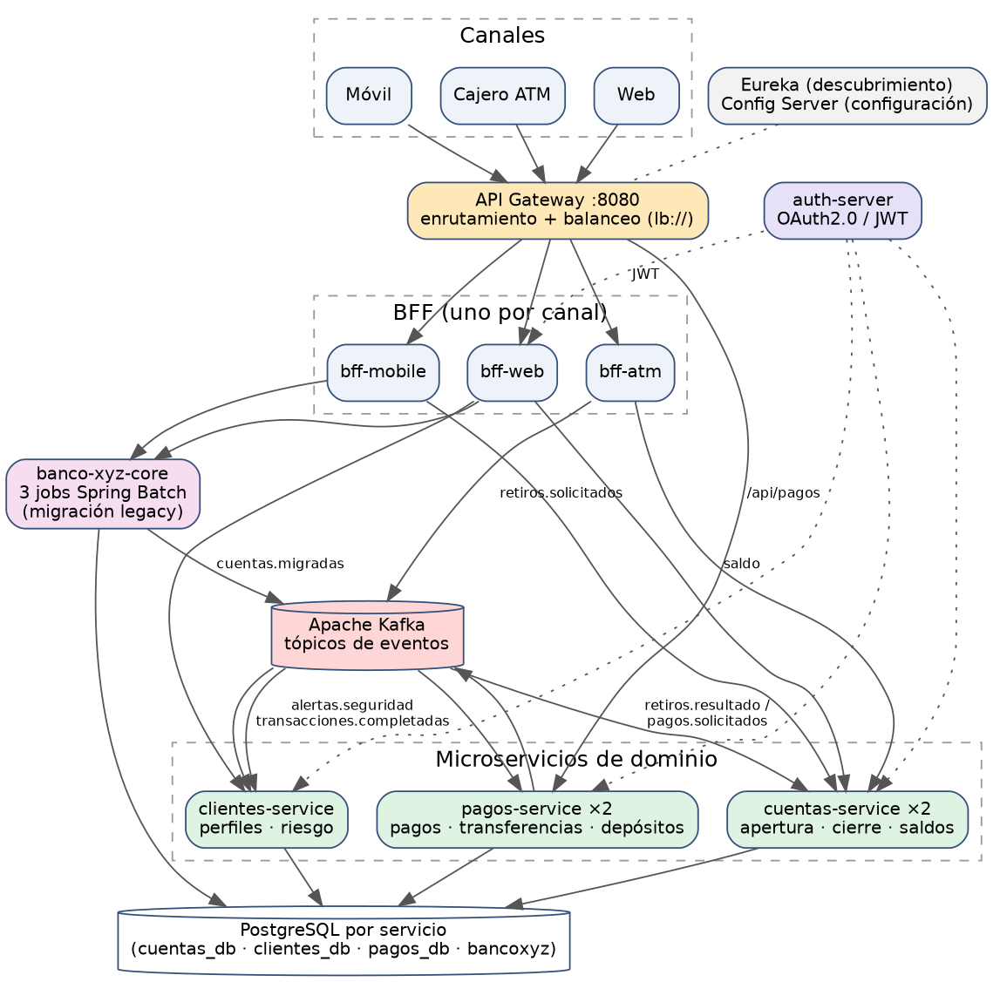

# Banco XYZ — Modernización a microservicios (Spring Cloud, Spring Batch y Kafka)

**Evaluación Final Transversal – Desarrollo Backend III (Semana 9)**
**Autora:** Francisca Valenzuela

🔗 **Repositorio GitHub:** https://github.com/Francisca-Valenzuela/Exp1_S1_Grupo5

> Solución backend para el **Banco XYZ**, que migra un sistema legacy (COBOL + Shell sobre mainframe) a una arquitectura
> de microservicios en la nube: procesos batch migrados a Spring Batch, un BFF por canal, microservicios de dominio
> resilientes, mensajería asíncrona con **Apache Kafka**, seguridad OAuth2.0 distribuida y despliegue con Docker Compose
> (preparado para AWS).

| Documento | Contenido |
|---|---|
| [`readme.md`](readme.md) | Este archivo: visión general y decisiones de arquitectura |
| [`instrucciones.md`](instrucciones.md) | Cómo ejecutar, probar y escalar la solución paso a paso |
| [`despliegue.md`](despliegue.md) | Cómo desplegarla en AWS (ECR, ECS Fargate, MSK, RDS, ALB) |
| `informe_tecnico.pdf` | Análisis de procesos, propuesta de arquitectura y justificación técnica |

---

## 1. Arquitectura



| Servicio | Rol | Puerto | Escalable |
|---|---|---|---|
| `api-gateway` | Punto de entrada único **HTTPS**; enruta por path y balancea (`lb://`) entre réplicas | 8443 (público) | ✅ |
| `bff-web` / `bff-mobile` / `bff-atm` | Un BFF por canal (respuesta completa / ligera / segura para cajero) | 8081 / 8082 / 8083 | ✅ |
| `cuentas-service` | **Gestión de Cuentas**: apertura, cierre, mantenimiento, saldos y aplicación de movimientos | 8085 | ✅ (2 réplicas) |
| `pagos-service` | **Procesamiento de Pagos**: pagos, transferencias y depósitos (saga + outbox) | 8087 | ✅ (2 réplicas) |
| `clientes-service` | **Gestión de Clientes**: datos personales, perfil y nivel de riesgo | 8086 | ✅ |
| `banco-xyz-core` | **3 jobs Spring Batch** de migración del legacy + API de reportes | 8443 (interno) | 1 instancia (batch) |
| `auth-server` | Authorization Server OAuth2.0 (JWT) | 9000 | – |
| `eureka-server` | Descubrimiento de servicios | 8761 | – |
| `config-server` | Spring Cloud Config (configuración centralizada) | 8888 | – |
| Apache Kafka (KRaft) | Bus de eventos | 9092 / 29092 | – |
| PostgreSQL ×4 | Una base de datos **por servicio** (`bancoxyz`, `cuentas_db`, `clientes_db`, `pagos_db`) | 5432, 5435-5437 | – |

## 2. Los cinco procesos clave identificados

| # | Proceso del caso | Solución implementada |
|---|---|---|
| 1 | Procesos batch legacy (transacciones diarias, intereses mensuales, estados de cuenta anuales) | **Spring Batch**: 3 jobs particionados, con *retry*, *skip*, listeners, política de finalización de chunk y reinicio automático |
| 2 | Backend monolítico → servicios independientes | **Microservicios** de Cuentas, Pagos y Clientes con base de datos propia |
| 3 | Frontends acoplados al mismo backend | **Patrón BFF**: web, móvil y cajero independientes, con autenticación por canal |
| 4 | Seguridad limitada y centralizada | **Seguridad distribuida**: OAuth2.0 + JWT, *resource server* en cada servicio, token relay, HTTPS en el borde |
| 5 | Integración síncrona frágil entre módulos | **Mensajería asíncrona con Kafka** + **Resilience4j** (Circuit Breaker, Retry, fallbacks) |

## 3. Procesos batch (`banco-xyz-core`)

| Job | Entrada | Resultado |
|---|---|---|
| `transaccionJob` | `transacciones.csv` | Reporte diario con detección de anomalías (monto alto, fecha futura, monto cero…) |
| `cuentaInteresJob` | `intereses.csv` | Intereses mensuales por tipo de cuenta + **publicación de las cuentas migradas en Kafka** (`cuentas.migradas`) |
| `cuentaAnualJob` | `cuentas_anuales.csv` | Estados de cuenta anuales para auditoría |

- **Paralelismo / volumen:** partición por rango de líneas (3 workers), chunk de 50 ítems, lectores sincronizados.
- **Fallos temporales:** `retry` con *backoff* exponencial ante `TransientDataAccessException`.
- **Datos inválidos:** `skip` con `CustomSkipPolicy` (límite configurable) y `BatchSkipListener` (auditoría de cada fila omitida).
- **Política de finalización:** el chunk se confirma al llegar a 50 ítems **o** a los 5 s (`CompositeCompletionPolicy`).
- **Reejecución automática:** `ResilientJobRunner` relanza con los mismos parámetros un job `FAILED` (hasta 3 intentos, *backoff* creciente); Spring Batch reinicia **solo desde el step/partición fallida**. `startLimit(5)` por step.
- **Equivalencia con el legacy:** se aceptan los 4 formatos de fecha del archivo origen (`yyyy-MM-dd`, `yyyy/MM/dd`, `dd-MM-yyyy`, `dd/MM/yyyy`) para no descartar filas válidas.

## 4. Mensajería con Kafka

| Tópico | Productor | Consumidor(es) | Propósito |
|---|---|---|---|
| `cuentas.migradas` | banco-xyz-core | cuentas-service, clientes-service | Carga inicial desde el legacy (idempotente) |
| `pagos.solicitados` | pagos-service | cuentas-service | Comando de pago/transferencia/depósito |
| `pagos.resultado` | cuentas-service | pagos-service | Resultado `APLICADO` / `RECHAZADO` |
| `retiros.solicitados` | bff-atm | cuentas-service | Retiro en cajero |
| `retiros.resultado` | cuentas-service | bff-atm | Resultado del retiro |
| `transacciones.completadas` | pagos-service | clientes-service | Evento de negocio: actualiza actividad del cliente |
| `alertas.seguridad` | pagos-service | clientes-service | Monto alto u operación rechazada → nivel de riesgo |
| `<tópico>.DLT` | (automático) | – | *Dead letter*: mensajes que agotaron los reintentos |

3 particiones por tópico y grupos de consumo por servicio: al añadir réplicas, Kafka reparte las particiones entre ellas.

## 5. Consistencia de datos en un entorno distribuido

No hay transacciones distribuidas (2PC). Se usa una **saga coreografiada** con garantías explícitas:

- **Transactional Outbox** (`pagos-service`): el pago se guarda antes de publicarse; si Kafka cae, `OutboxScheduler` lo reenvía.
- **Idempotencia** (`cuentas-service`): tabla `operaciones_procesadas` por `solicitudId`. Una entrega duplicada nunca descuenta dos veces.
- **Bloqueo pesimista** de cuentas (en orden de id → sin *deadlocks*) y `@Version` (bloqueo optimista).
- **Transferencias atómicas:** origen y destino viven en el mismo servicio → una sola transacción local.
- **Clave de idempotencia HTTP:** cabecera `Idempotency-Key` en los endpoints de pagos.
- **Dead Letter Topic** + reintentos con *backoff* exponencial en todos los consumidores.

## 6. Resiliencia (Resilience4j) y comportamientos alternativos

| Llamada | Protección | Alternativa ante fallo |
|---|---|---|
| bff-* → cuentas-service | Retry + Circuit Breaker | HTTP **503** controlado (dato esencial) |
| bff-web → clientes-service / core | Retry + Circuit Breaker | Respuesta **parcial** (`datosParciales: true`) |
| bff-mobile → core | Retry + Circuit Breaker | Saldo sin movimientos recientes |
| bff-atm → Kafka | Retry + Circuit Breaker | 503 con mensaje claro; el retiro no se pierde ni se duplica |
| cuentas-service → clientes-service | Retry + Circuit Breaker | Cuenta en estado `PENDIENTE_VALIDACION` |
| pagos-service → cuentas-service | Retry + Circuit Breaker | Se acepta y se valida de forma asíncrona |
| pagos-service → Kafka | Retry + Circuit Breaker | Queda en **outbox** y se reenvía |

Todas las llamadas HTTP además tienen *timeouts* (conexión 2 s, lectura 3 s).

## 7. Seguridad

- **Authorization Server** propio (Spring Authorization Server) con un cliente por canal: `web-client`, `mobile-client`, `atm-client` e `internal-client` (servicio a servicio).
- Cada microservicio es **Resource Server**: valida firma (JWKS), emisor y **scope**. Lectura/escritura separadas por scope.
- **Token relay:** los BFF reenvían el JWT del canal a los microservicios (propagación de identidad).
- **HTTPS** en el API Gateway (TLS 1.2/1.3, PKCS12). En AWS lo termina el ALB (ACM).
- Reglas propias del cajero: tope por retiro y múltiplos de 1.000.
- Contenedores sin usuario root. Solo el gateway publica un puerto HTTPS hacia el exterior (más auth-server, Eureka y Config para administración local); `actuator` solo es alcanzable dentro de la red de Docker.

## 8. Observabilidad

`/actuator/health`, `/actuator/metrics`, `/actuator/circuitbreakers` y `/actuator/prometheus` en cada servicio; Prometheus opcional
(`docker compose --profile monitoring up -d prometheus`, puerto 9090). Logs con el `solicitudId` de cada operación.

## 9. Escalabilidad horizontal

`docker compose up -d --build` levanta `cuentas-service` y `pagos-service` con 2 réplicas cada uno. Cualquier servicio sin puerto
publicado se escala con `--scale` (ver [`instrucciones.md`](instrucciones.md)). El gateway reparte la carga con Spring Cloud LoadBalancer y
Kafka reparte las particiones entre réplicas.

## 10. Estructura del repositorio

```
api-gateway/  auth-server/  config-server/  eureka-server/
banco-xyz-core/        # Spring Batch
cuentas-service/  pagos-service/  clientes-service/
bff-web/  bff-mobile/  bff-atm/
infra/prometheus/  docs/img/
docker-compose.yaml  readme.md  instrucciones.md  despliegue.md
```

## 11. Tecnologías

Java 21 · Spring Boot 4.1 · Spring Cloud 2025.1 (Config, Eureka, LoadBalancer, Gateway) · Spring Batch · Spring Security / Authorization Server ·
Spring Kafka · Resilience4j · JPA/Hibernate · PostgreSQL 16 · Apache Kafka 3.9 (KRaft) · Docker / Docker Compose · Micrometer + Prometheus.

## 12. Limitaciones conocidas

- Estado de retiros del cajero en memoria (con varias réplicas de `bff-atm`, la consulta ocurre en la réplica que recibió el retiro o tras recibir el resultado); en producción iría a Redis.
- Kafka de un solo broker y sin autenticación (válido para desarrollo; en AWS se usa MSK con TLS/IAM).
- `banco-xyz-core` debe ejecutarse en **una** instancia (los jobs corren al arrancar; `batch.run-on-startup=false` para desactivarlo).
- Certificado TLS autofirmado solo para desarrollo.
