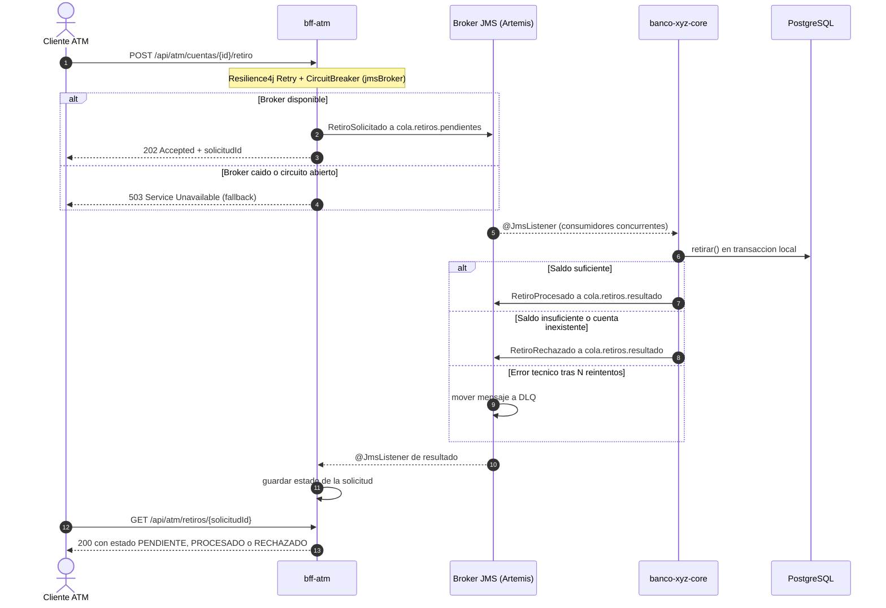

# Banco XYZ - Arquitectura de Microservicios, Spring Batch y Eventos Asíncronos

## Objetivo del proyecto

Este proyecto moderniza tres procesos batch legacy del **Banco XYZ** (un banco ficticio) utilizando **Spring Batch**, y expone esos datos a través de un ecosistema de **Microservicios (BFFs)** adaptado a tres tipos de cliente: Web, Móvil y Cajero Automático. En sus últimas iteraciones, el sistema ha evolucionado hacia una arquitectura nativa en la nube utilizando **Spring Cloud** para el descubrimiento y configuración de servicios, **Resilience4j** para tolerancia a fallos, y **JMS (ActiveMQ Artemis)** para el procesamiento asíncrono de transacciones críticas. En la **Semana 8** se agrega seguridad con **OAuth2.0** (Spring Authorization Server) y todo el ecosistema se **dockeriza** y se orquesta con un único `docker-compose.yaml`.

## Estructura del Ecosistema

El proyecto está dividido en los siguientes microservicios:
*   `auth-server`: **Servidor de autorización OAuth2.0** (Spring Authorization Server). Emite los access tokens (JWT) por canal.
*   `eureka-server`: Servidor de descubrimiento de servicios (Service Discovery).
*   `config-server`: Servidor de configuración centralizada.
*   `banco-xyz-core`: Núcleo del sistema. Ejecuta los procesos Batch, expone la lógica de negocio interna y actúa como Consumidor JMS.
*   `bff-web`: Backend for Frontend para el canal Web (Consultas paginadas, datos completos).
*   `bff-mobile`: Backend for Frontend para el canal Móvil (Consultas optimizadas, últimos movimientos).
*   `bff-atm`: Backend for Frontend para Cajeros Automáticos (Consultas de saldo y envío asíncrono de retiros vía JMS).
*   `docker-compose.yaml`: orquesta infraestructura (PostgreSQL, Artemis) y los 7 microservicios.
*   `<servicio>/Dockerfile`: imagen Docker multi-etapa de cada microservicio.

---

## Novedades Semanas 1 a 3: Migración Batch Legacy

Se implementaron tres Jobs que leen, validan/transforman y persisten información legacy en PostgreSQL:
1.  `transaccionJob`: Reporte de transacciones diarias, detectando anomalías.
2.  `cuentaInteresJob`: Cálculo de intereses mensuales.
3.  `cuentaAnualJob`: Generación de estados de cuenta anuales.

Se utiliza procesamiento multihilo, colecciones concurrentes, manejo de errores tolerante a fallos (`SkipPolicy`, `RetryLimit`) y escalado avanzado con particiones (`PartitionStep`, `gridSize=3`).

---

## Novedades Semanas 4 y 5: BFF, JWT y Seguridad HTTPS

- **Diseño de Endpoints Personalizados (BFF):** Tres aplicaciones Spring Boot exponen rutas, DTOs y reglas de seguridad distintas por canal (`/api/web/**`, `/api/mobile/**`, `/api/atm/**`).
- **Seguridad y JWT:** Autenticación y autorización por canal mediante tokens JWT firmados (HS256). *(Reemplazado en la Semana 8 por OAuth2.0, ver más abajo.)*
- **HTTPS:** Todo el tráfico viaja cifrado (`https://localhost:8443`) utilizando un certificado autofirmado PKCS12, con redirección automática desde HTTP.

---

## Novedades Semanas 6 y 7: Cloud, Resiliencia y Arquitectura de Eventos

### 1. Ecosistema Spring Cloud
El proyecto ahora opera como un clúster distribuido:
- **Config Server:** Centraliza las propiedades de los microservicios (alojadas en `config-repo/`).
- **Eureka Server:** Permite que los BFFs descubran dinámicamente a `banco-xyz-core` sin depender de IPs o puertos fijos, habilitando el balanceo de carga en los clientes REST (`@LoadBalanced`).

### 2. Tolerancia a Fallos con Resilience4j
Se integró el patrón **Circuit Breaker** y **Retry** en las llamadas síncronas de los BFFs (Web, Móvil, ATM) hacia el Core. Si el Core falla o experimenta latencia, el circuito se abre y se ejecuta un método *Fallback* que devuelve un error controlado (HTTP 503), evitando la saturación de los hilos de red y caídas en cascada.

### 3. Arquitectura Orientada a Eventos (JMS)
El endpoint crítico de retiros en el canal Cajero (`POST /api/atm/cuentas/{id}/retiro`) fue refactorizado para operar de forma **asíncrona** utilizando una cola de mensajes.

**Patrón elegido: Saga coreografiada sobre JMS (ActiveMQ Artemis).**

El retiro del cajero es una operación distribuida: bff-atm recibe la orden y
banco-xyz-core modifica el saldo. En lugar de una llamada síncrona, cada
servicio ejecuta su transacción local y publica un evento; no existe un
orquestador central (coreografía).

- `RetiroSolicitado` (cola `cola.retiros.pendientes`): lo publica bff-atm con
  un `solicitudId` (UUID) que identifica la operación de punta a punta.
- `RetiroProcesado` / `RetiroRechazado` (cola `cola.retiros.resultado`): los
  publica banco-xyz-core tras su transacción local. Si el saldo es
  insuficiente, no se descuenta nada y se informa el rechazo con su motivo.
- `DLQ`: los mensajes que fallan por error técnico tras varios reintentos se
  desvían aquí en lugar de perderse.

**¿Por qué JMS y no Kafka?** Se usó el modelo Point-to-Point porque cada retiro
debe ser procesado por un único consumidor para evitar cobros duplicados. Kafka
(publish-subscribe con retención de eventos, típico de Event Sourcing) aporta
reproducción del historial, que no se necesita para una orden financiera de un
solo uso. La escalabilidad se logra con varios consumidores concurrentes sobre
la misma cola (competing consumers).

**Consulta del resultado:** como el retiro es asíncrono, `POST /retiro` responde
`202 Accepted` con el `solicitudId`, y el cajero consulta el estado final en
`GET /api/atm/retiros/{solicitudId}` (PENDIENTE, PROCESADO o RECHAZADO).

#### Diagrama de Secuencia de Retiro Asíncrono


---

## Novedades Semana 8: OAuth2.0, Docker y Docker Compose

### 1. Seguridad con OAuth2.0
Se creó el microservicio `auth-server` (**Spring Authorization Server**, puerto `9000`) que actúa como **Authorization Server**. Los tres BFF son **Resource Servers** que validan el JWT con la clave pública que publica `auth-server` (`/oauth2/jwks`) y exigen un *scope* por canal.

| Client ID | Flujo | Scope | Acceso permitido |
|---|---|---|---|
| `web-client` | `client_credentials` | `web` | `bff-web` → `/api/web/**` |
| `mobile-client` | `client_credentials` | `mobile` | `bff-mobile` → `/api/mobile/**` |
| `atm-client` | `client_credentials` | `atm` | `bff-atm` → `/api/atm/**` |

- Los secretos se guardan cifrados con **bcrypt** en `auth-server/src/main/resources/application.yml`.
- Access token: formato JWT (`self-contained`), vigencia **30 minutos**.
- Sin token → `401`; token de otro canal (scope incorrecto) → `403`; secreto de cliente incorrecto → `401`.
- El claim `iss` se fija con la variable `AUTH_ISSUER` y debe coincidir con `issuer-uri` del perfil `docker` de los BFF.
- `banco-xyz-core` es un servicio interno: solo acepta llamadas de los BFF mediante la clave de servicio `internal.api-key`.

### 2. Dockerización de los microservicios
Cada microservicio tiene su propio `Dockerfile` **multi-etapa**:
1. **build**: `maven:3.9-eclipse-temurin-21` compila y empaqueta el `.jar`.
2. **runtime**: `eclipse-temurin:21-jre-alpine` (solo JRE), ejecuta con usuario no-root.

Cada carpeta incluye un `.dockerignore` (excluye `target/`, `.git/`, etc.) para que el build sea rápido y reproducible.
Imágenes resultantes: `banco-xyz/eureka-server`, `config-server`, `auth-server`, `banco-xyz-core`, `bff-web`, `bff-mobile` y `bff-atm`.

### 3. Orquestación con `docker-compose.yaml`
Un solo archivo levanta **9 contenedores** en la red `banco-xyz-net`:

| Servicio | Puerto | Depende de (healthy) |
|---|---|---|
| `banco-xyz-postgres` | 5432 | - |
| `banco-xyz-artemis` | 61616 / 8161 | - |
| `eureka-server` | 8761 | - |
| `config-server` | 8888 | eureka-server |
| `auth-server` | 9000 | - |
| `banco-xyz-core` | 8443 | postgres, artemis, eureka, config |
| `bff-web` | 8081 | config, eureka, auth, core |
| `bff-mobile` | 8082 | config, eureka, auth, core |
| `bff-atm` | 8083 | config, eureka, auth, artemis, core |

- Todos tienen **healthcheck** y `depends_on: condition: service_healthy`, por lo que el orden de arranque es automático.
- Dentro de Docker los servicios se ubican por **nombre** (`eureka-server`, `config-server`, `auth-server`...). Esto se logra con el perfil `docker` (`SPRING_PROFILES_ACTIVE=docker`), cuyo archivo `config-server/src/main/resources/config-repo/application-docker.yml` entrega las URLs correctas; la conexión a PostgreSQL y Artemis se entrega por variables de entorno del compose.
- El mismo código sigue funcionando **sin Docker** (perfil por defecto, `localhost`).

---

## Cómo ejecutar el proyecto

### Opción A (recomendada): todo con Docker Compose
Requisitos: Docker Desktop (recomendado ≥ 6 GB de RAM asignados) y los puertos 5432, 61616, 8161, 8761, 8888, 9000, 8443 y 8081-8083 libres.

```bash
# Si existían contenedores de versiones anteriores, eliminarlos primero
docker rm -f banco-xyz-postgres banco-xyz-artemis

docker compose up -d --build     # construye las 7 imágenes y levanta todo
docker compose ps                # esperar a que todos estén "healthy" (2-4 min)
docker compose logs -f banco-xyz-core   # (opcional) ver la ejecución de los 3 jobs batch
```

Verificar: Eureka `http://localhost:8761` debe mostrar `CONFIG-SERVER`, `BANCO-XYZ-CORE`, `BFF-WEB`, `BFF-MOBILE` y `BFF-ATM`. Consola de Artemis: `http://localhost:8161`.

Detener: `docker compose down` (agregar `-v` para borrar también la base de datos).

### Opción B: ejecución local (sin Docker para los microservicios)
```bash
docker compose up -d banco-xyz-postgres banco-xyz-artemis   # solo infraestructura
```
Luego, cada servicio en su propia terminal y en este orden (esperar a que cada uno arranque):
```bash
cd eureka-server  && ./mvnw spring-boot:run
cd config-server  && ./mvnw spring-boot:run
cd auth-server    && ./mvnw spring-boot:run
cd banco-xyz-core && ./mvnw spring-boot:run
cd bff-web        && ./mvnw spring-boot:run
cd bff-mobile     && ./mvnw spring-boot:run
cd bff-atm        && ./mvnw spring-boot:run
```

---

## Pruebas (evidencia de ejecución)

Las capturas están en `Evidencias.docx`. Para reproducirlas (`curl` en Linux/Mac/Git Bash; en PowerShell usar `curl.exe`):

**OAuth2.0**
```bash
# 1) Obtener token del cajero (200 + access_token, scope "atm")
curl -s -u atm-client:<secreto> -d "grant_type=client_credentials&scope=atm" http://localhost:9000/oauth2/token

# 2) Usar el token válido (200)
curl -i -H "Authorization: Bearer <TOKEN>" http://localhost:8083/api/atm/cuentas/101/saldo

# 3) Sin token (401)
curl -i http://localhost:8083/api/atm/cuentas/101/saldo

# 4) Token del cajero contra el BFF web (403)
curl -i -H "Authorization: Bearer <TOKEN_ATM>" http://localhost:8081/api/web/transacciones

# 5) Secreto incorrecto (401)
curl -i -u atm-client:incorrecto -d "grant_type=client_credentials&scope=atm" http://localhost:9000/oauth2/token
```
Igual para `web-client` (`:8081/api/web/...`) y `mobile-client` (`:8082/api/mobile/cuentas/{id}`).

**Mensajería asíncrona (JMS)**
```bash
# Enviar retiro -> 202 Accepted + solicitudId
curl -i -X POST -H "Authorization: Bearer <TOKEN_ATM>" -H "Content-Type: application/json" \
     -d '{"monto": 1000}' http://localhost:8083/api/atm/cuentas/101/retiro

# Consultar el resultado final (PENDIENTE / PROCESADO / RECHAZADO)
curl -s -H "Authorization: Bearer <TOKEN_ATM>" http://localhost:8083/api/atm/retiros/<solicitudId>
```

**Tolerancia a fallos (Resilience4j)**
```bash
docker compose stop banco-xyz-core        # simular caída del core
# repetir 5+ veces una consulta con token válido -> respuesta 503 controlada (fallback)
curl -i -H "Authorization: Bearer <TOKEN_ATM>" http://localhost:8083/api/atm/cuentas/101/saldo
curl -s http://localhost:8083/actuator/circuitbreakers     # estado del circuito: OPEN
docker compose start banco-xyz-core       # tras ~10 s pasa a HALF_OPEN y luego CLOSED

docker compose stop banco-xyz-artemis     # simular caída del broker
# POST de retiro -> 503 (fallback del circuito "jmsBroker")
docker compose start banco-xyz-artemis
```
