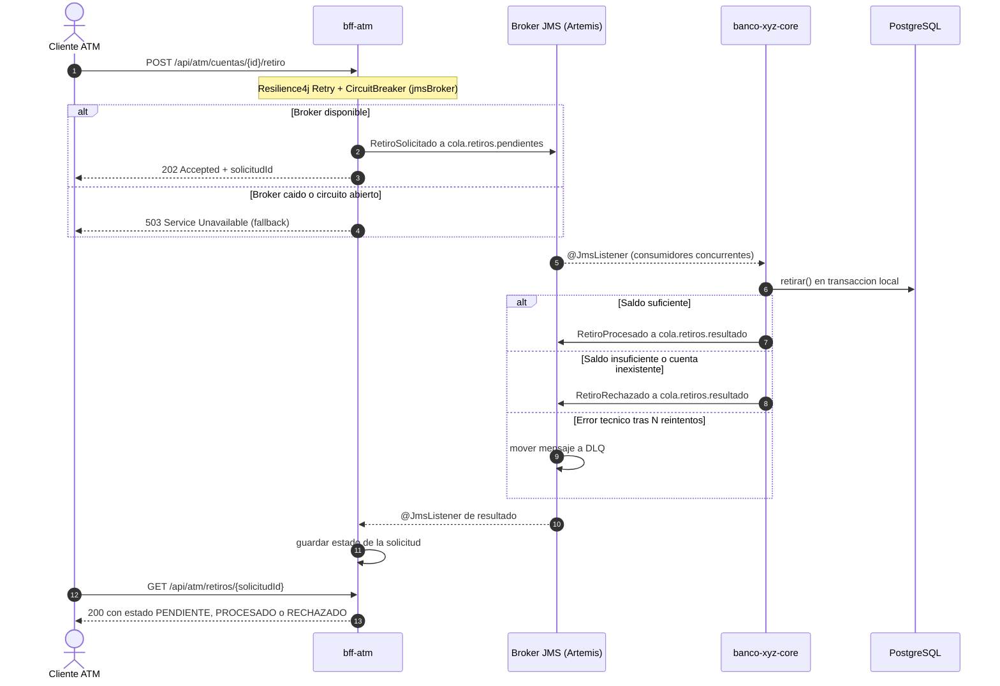

# Banco XYZ - Arquitectura de Microservicios, Spring Batch y Eventos Asíncronos

## Objetivo del proyecto

Este proyecto moderniza tres procesos batch legacy del **Banco XYZ** (un banco ficticio) utilizando **Spring Batch**, y expone esos datos a través de un ecosistema de **Microservicios (BFFs)** adaptado a tres tipos de cliente: Web, Móvil y Cajero Automático. En sus últimas iteraciones, el sistema ha evolucionado hacia una arquitectura nativa en la nube utilizando **Spring Cloud** para el descubrimiento y configuración de servicios, **Resilience4j** para tolerancia a fallos, y **JMS (ActiveMQ Artemis)** para el procesamiento asíncrono de transacciones críticas.

## Estructura del Ecosistema

El proyecto está dividido en los siguientes microservicios:
*   `eureka-server`: Servidor de descubrimiento de servicios (Service Discovery).
*   `config-server`: Servidor de configuración centralizada.
*   `banco-xyz-core`: Núcleo del sistema. Ejecuta los procesos Batch, expone la lógica de negocio interna y actúa como Consumidor JMS.
*   `bff-web`: Backend for Frontend para el canal Web (Consultas paginadas, datos completos).
*   `bff-mobile`: Backend for Frontend para el canal Móvil (Consultas optimizadas, últimos movimientos).
*   `bff-atm`: Backend for Frontend para Cajeros Automáticos (Consultas de saldo y envío asíncrono de retiros vía JMS).

---

## Novedades Semanas 1 a 3: Migración Batch Legacy

Se implementaron tres Jobs que leen, validan/transforman y persisten información legacy en PostgreSQL:
1.  `transaccionJob`: Reporte de transacciones diarias, detectando anomalías.
2.  `cuentaInteresJob`: Cálculo de intereses mensuales.
3.  `cuentaAnualJob`: Generación de estados de cuenta anuales.

Se utiliza procesamiento multihilo, colecciones concurrentes, manejo de errores tolerante a fallos (`SkipPolicy`, `RetryLimit`) y escalado avanzado con particiones (`PartitionStep`, `gridSize=3`).

---

## Novedades Semanas 4 y 5: BFF, JWT y Seguridad HTTPS

- **Diseño de Endpoints Personalizados (BFF):** Tres aplicaciones Spring Boot exponen rutas, DTOs y reglas de seguridad distintas por canal (`/api/web/**`, `/api/mobile/**`, `/api/atm/**`).
- **Seguridad y JWT:** Autenticación y autorización por canal mediante tokens JWT firmados (HS256). Validación stateless a través de `JwtAuthenticationFilter`.
- **HTTPS:** Todo el tráfico viaja cifrado (`https://localhost:8443`) utilizando un certificado autofirmado PKCS12, con redirección automática desde HTTP.

---

## Novedades Semanas 6 y 7: Cloud, Resiliencia y Arquitectura de Eventos

### 1. Ecosistema Spring Cloud
El proyecto ahora opera como un clúster distribuido:
- **Config Server:** Centraliza las propiedades de los microservicios (alojadas en `config-repo/`).
- **Eureka Server:** Permite que los BFFs descubran dinámicamente a `banco-xyz-core` sin depender de IPs o puertos fijos, habilitando el balanceo de carga en los clientes REST (`@LoadBalanced`).

### 2. Tolerancia a Fallos con Resilience4j
Se integró el patrón **Circuit Breaker** y **Retry** en las llamadas síncronas de los BFFs (Web, Móvil, ATM) hacia el Core. Si el Core falla o experimenta latencia, el circuito se abre y se ejecuta un método *Fallback* que devuelve un error controlado (HTTP 503), evitando la saturación de los hilos de red y caídas en cascada.

### 3. Arquitectura Orientada a Eventos (JMS)
El endpoint crítico de retiros en el canal Cajero (`POST /api/atm/cuentas/{id}/retiro`) fue refactorizado para operar de forma **asíncrona** utilizando una cola de mensajes.

**Patrón elegido: Saga coreografiada sobre JMS (ActiveMQ Artemis).**

El retiro del cajero es una operación distribuida: bff-atm recibe la orden y
banco-xyz-core modifica el saldo. En lugar de una llamada síncrona, cada
servicio ejecuta su transacción local y publica un evento; no existe un
orquestador central (coreografía).

- `RetiroSolicitado` (cola `cola.retiros.pendientes`): lo publica bff-atm con
  un `solicitudId` (UUID) que identifica la operación de punta a punta.
- `RetiroProcesado` / `RetiroRechazado` (cola `cola.retiros.resultado`): los
  publica banco-xyz-core tras su transacción local. Si el saldo es
  insuficiente, no se descuenta nada y se informa el rechazo con su motivo.
- `DLQ`: los mensajes que fallan por error técnico tras varios reintentos se
  desvían aquí en lugar de perderse.

**¿Por qué JMS y no Kafka?** Se usó el modelo Point-to-Point porque cada retiro
debe ser procesado por un único consumidor para evitar cobros duplicados. Kafka
(publish-subscribe con retención de eventos, típico de Event Sourcing) aporta
reproducción del historial, que no se necesita para una orden financiera de un
solo uso. La escalabilidad se logra con varios consumidores concurrentes sobre
la misma cola (competing consumers).

**Consulta del resultado:** como el retiro es asíncrono, `POST /retiro` responde
`202 Accepted` con el `solicitudId`, y el cajero consulta el estado final en
`GET /api/atm/retiros/{solicitudId}` (PENDIENTE, PROCESADO o RECHAZADO).

#### Diagrama de Secuencia de Retiro Asíncrono

## Cómo ejecutar el proyecto

1. Levantar la infraestructura: `docker compose up -d` (PostgreSQL en :5432, Artemis en :61616 y su consola en :8161).
2. Iniciar los servicios, cada uno en su propia terminal y en este orden, esperando a que cada uno arranque antes de iniciar el siguiente:

cd eureka-server && ./mvnw spring-boot:run
cd config-server && ./mvnw spring-boot:run
cd banco-xyz-core && ./mvnw spring-boot:run
cd bff-atm && ./mvnw spring-boot:run

3. Verificar en `http://localhost:8761` que `CONFIG-SERVER`, `BANCO-XYZ-CORE` y `BFF-ATM` aparezcan registrados.
4. Probar el flujo: `POST /api/auth/login` para obtener el token, luego `POST /api/atm/cuentas/{id}/retiro` y `GET /api/atm/retiros/{solicitudId}` para consultar el resultado.